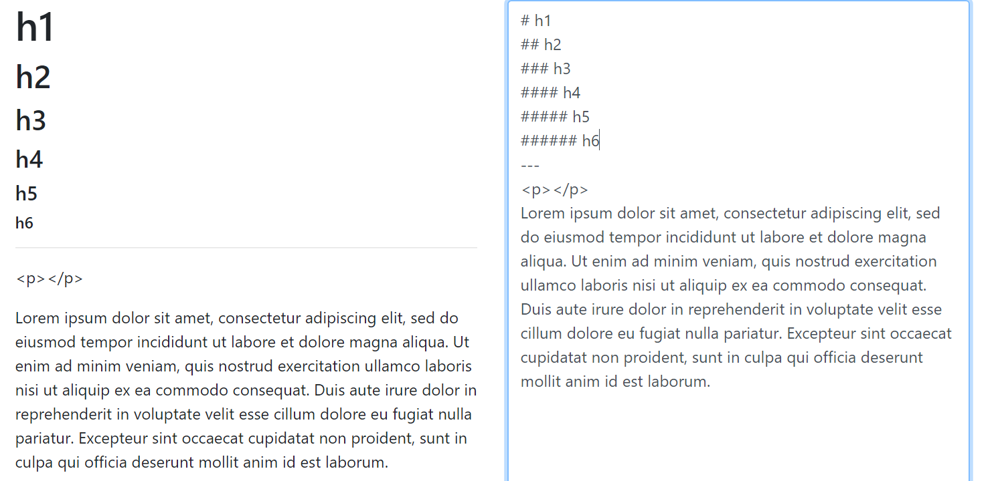
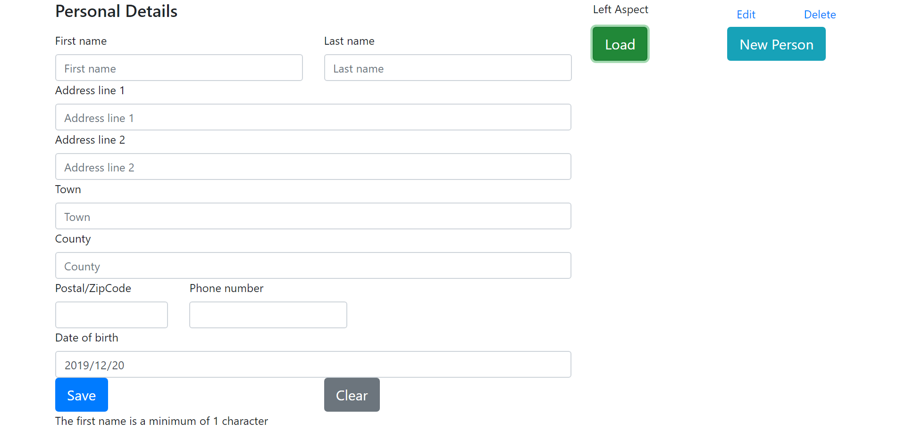
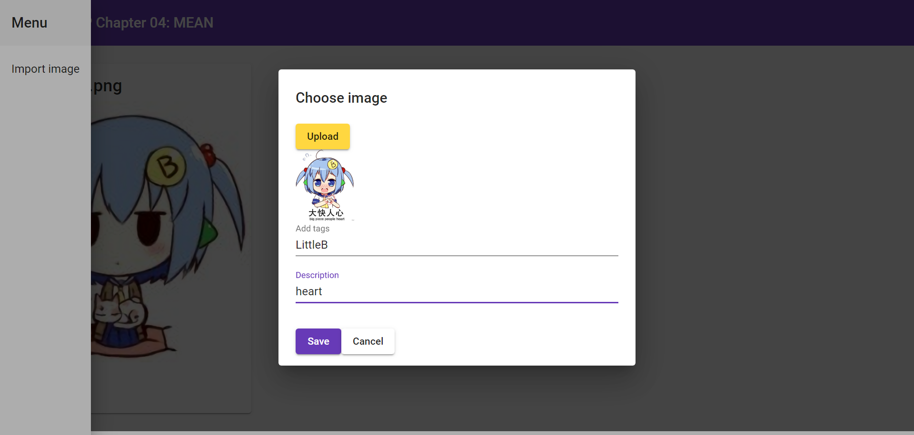
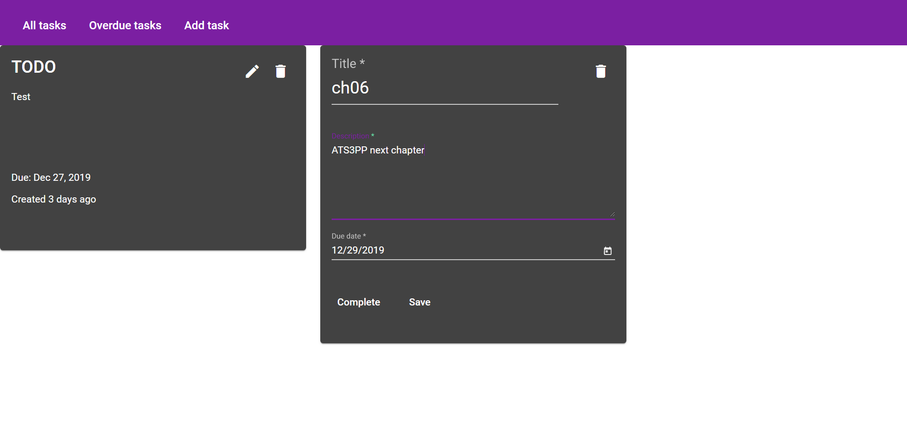
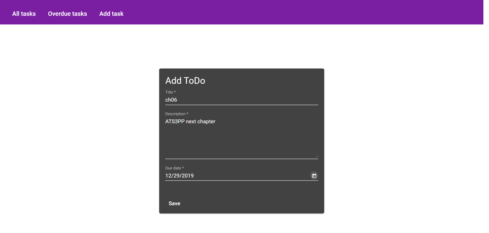
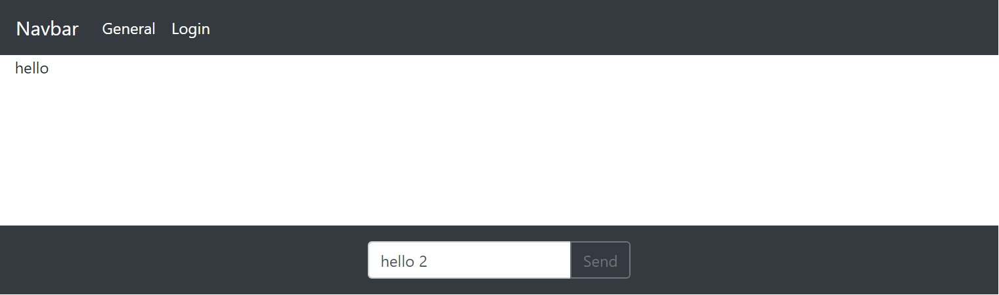
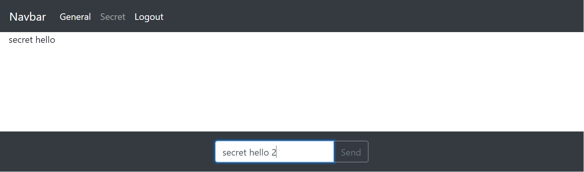
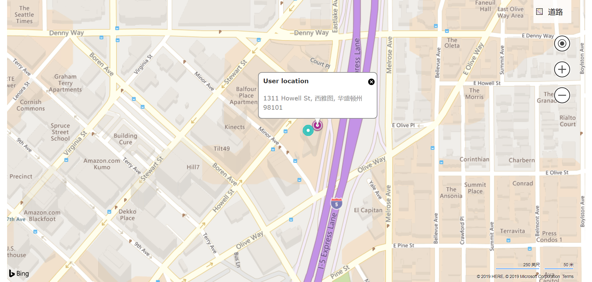

# Learning Advanced-TypeScript-3-Programming-Projects

Practices on reading the book [Advanced TypeScript 3 Programming Projects](https://www.packtpub.com/application-development/advanced-typescript-3-programming-projects?utm_source=github&utm_medium=repository&utm_campaign=)

## Chapter 1

Some TypeScript features, including

+ Union types
+ Intersection types
+ Mixins
+ Decorators
+ ...

And a introduction to Bootstrap.

## Chapter 2


A simple Markdown editor, supporting

+ h1 to h6
+ hr, and p

I also added an escaping function to prevent injecting HTML codes.

### How to run

Under `ch02` folder, run command

```shell script
npm install typescript --save-dev
tsc
```

Then deploy `index.html` and `script/` to anywhere you like.
I just used the simple local host in WebStorm.

## Chapter 3


A React Bootstrap Personal Contacts Manager, including

+ A form with validations
+ A list of entities
+ IndexedDB for local storage

## Chapter 4


A MEAN Photo Gallery, including

+ Angular frontend, with Material
+ Node.js backend, with Express.js
+ MongoDB to store the pictures

## Chapter 5



Angular ToDo App with GraphQL and Apollo, including

+ Angular frontend, with Apollo client and routing
+ Node.js backend, with Apollo server and GraphQL resolver
+ MongoDB to store the data

## Chapter 6



Angular Chat Room Application Using Socket.IO, including

+ Angular frontend, with Socket.IO and auto0
+ Node.js backend, with Socket.IO and
+ MongoDB to store the data

## Chapter 7


Angular Cloud-Based Mapping with Firebase

+ Angular frontend, with Bing Map
+ Firebase backend to store the data

### Note
The secrets of Bing Map and Firebase are in `environment.ts` and `environment.prod.ts`, but their values are not commited.
